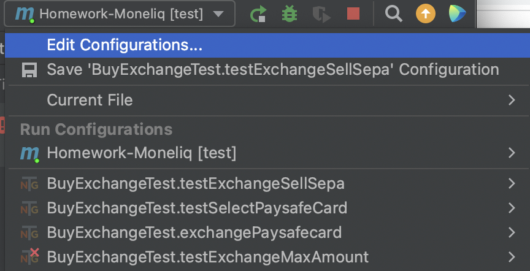
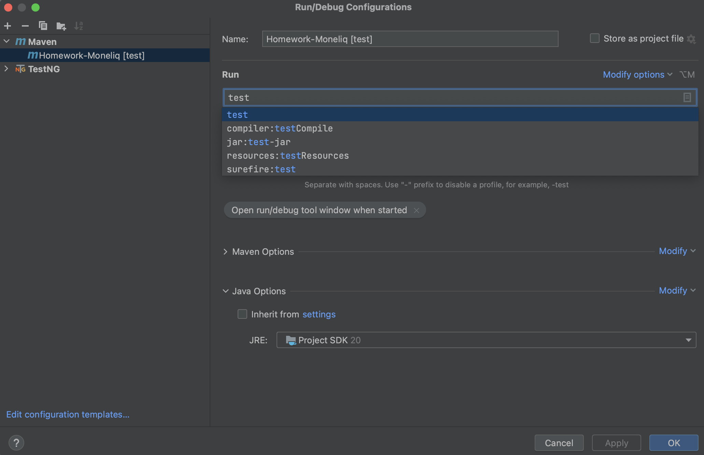
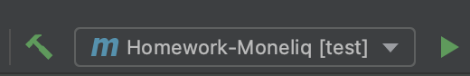
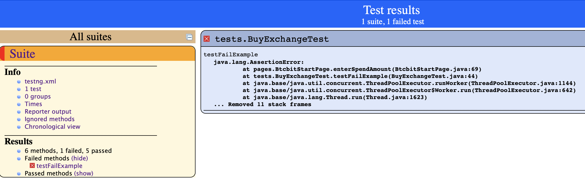
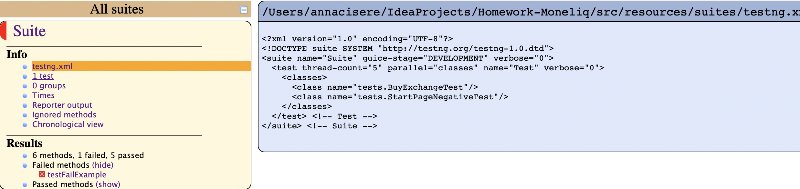
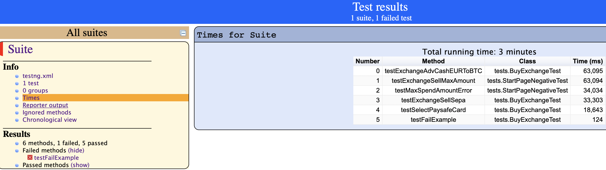
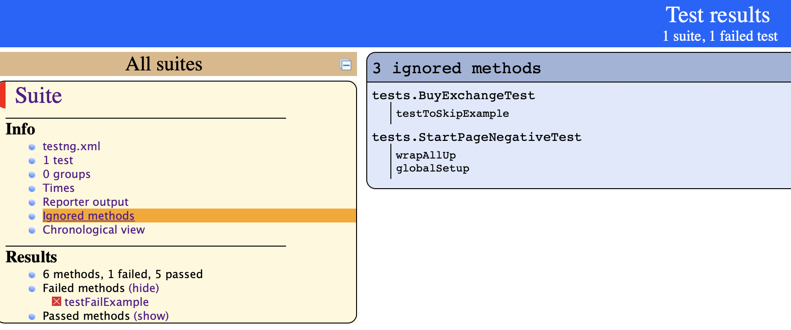
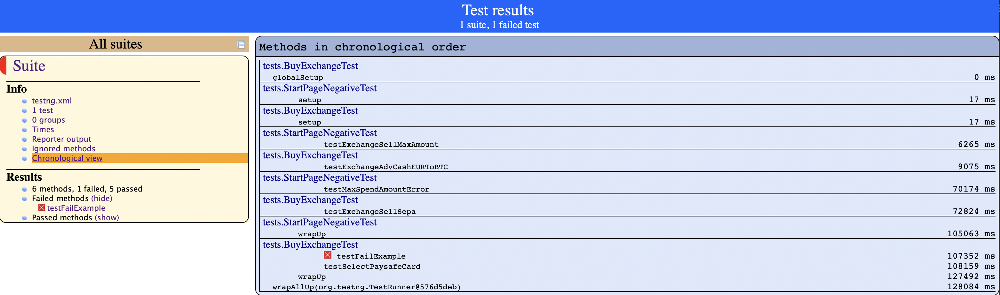
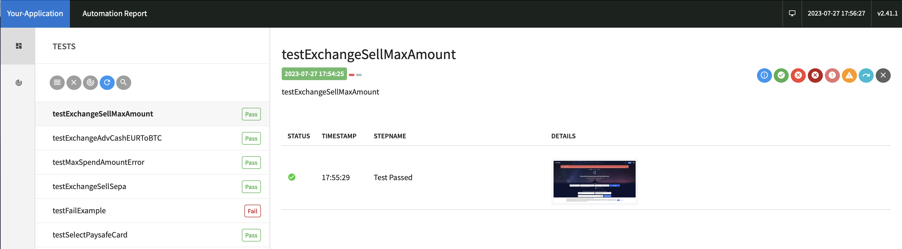

# Overview

This repository contains code for implementation of interview home assignment for test automation engineer role (AQA).

##  Task

The task is to create an automated test suite for our crypto exchange platform. The platform functionality allows users to buy and sell various cryptocurrencies.
Create a new git repository for the work. Name the repository "exchange-automation-tests".

Review the website (btcbit.net) and write test scenarios for any functionality you find
interesting. Describe the steps that a user would take and the expected results. Include
positive and negative scenarios.
Implement the test scenarios using Selenium WebDriver (or any other program) and your
preferred programming language.
Analyze and report the test results. Create a report that includes the number of tests passed,
failed, and skipped. Include screenshots and error messages for failed tests.
Create a testing documentation for the chosen functionality. Include the test scenarios,
implementation details, and test results.

##  Solution description

During the task there was created a framework based on Page Object Model, Selenium, TestNG using java.
This framework is based on Page Object Model (POM).
The framework uses:
1. Java
2. Selenium
3. TestNG
4. ExtendReport
5. Log4J

##  Test scenarios

For testing I have chosen the exchange functionality on the btcbit.net start/home page - "BUY" cryptocurrency.

### Positive Scenarios
1. Buy calculator: User enters 100 EUR in "SPEND" field and default "AdvCash" value as payment method. Expected result: Calculator fee block is displayed
2. Buy calculator: User enters 100 EUR in "SPEND" field and selects "PaysafeCard" value as payment method. Expected result: Calculator fee block is displayed
3. Sell calculator: User enters 0.01 BTC in "SPEND" field and leave default payment method Sepa. Expected result: Calculator fee block is displayed

### Negative Scenarios
1. User enters 5000 EUR in "SPEND" field and chooses "AdvCash" as payment method. Expected result: "Amount must be less than 1000 EUR" message is shown
2. User enters 5000 EUR in "SPEND" field and chooses "AdvCash" as payment method. Expected result: "Amount must be less than 1000 EUR" message is shown

The same message should be verified for all payment methods. All methods have different amounts.

For testing purposes I have added one test as failed and one test as skipped so you van verify this functionality

##  Setup Instruction

For the test run you will need IntellijIdea.
1. Open the project.
2. Open project run configuration.

3. Edit run configurations and add 'Test'.
 

4. Click run button

## Reporting

After the test run you will get two reports

### Surefire report

After the test run user will see in you user directory surefire report.
Here is an example how it will look like for me:
"Please refer to IdeaProjects/Homework-Moneliq/target/surefire-reports for the individual test results."

On this screenshot you will see that one test is failed.

On this screenshot you see testng.xml file.
Two test classes were run in parallel.

On the "Time" chapter you will test execution time.

On this screenshot you will see the tests that were skipped/ignored. I have added one for demo purpose.

On this screenshot you will see test chronological view.

### Extended report

On this screenshot you will see Extended test report with the screenshots after success and failure.
Report is located "IdeaProjects/Homework-Moneliq/ExtentReports" in my case.

